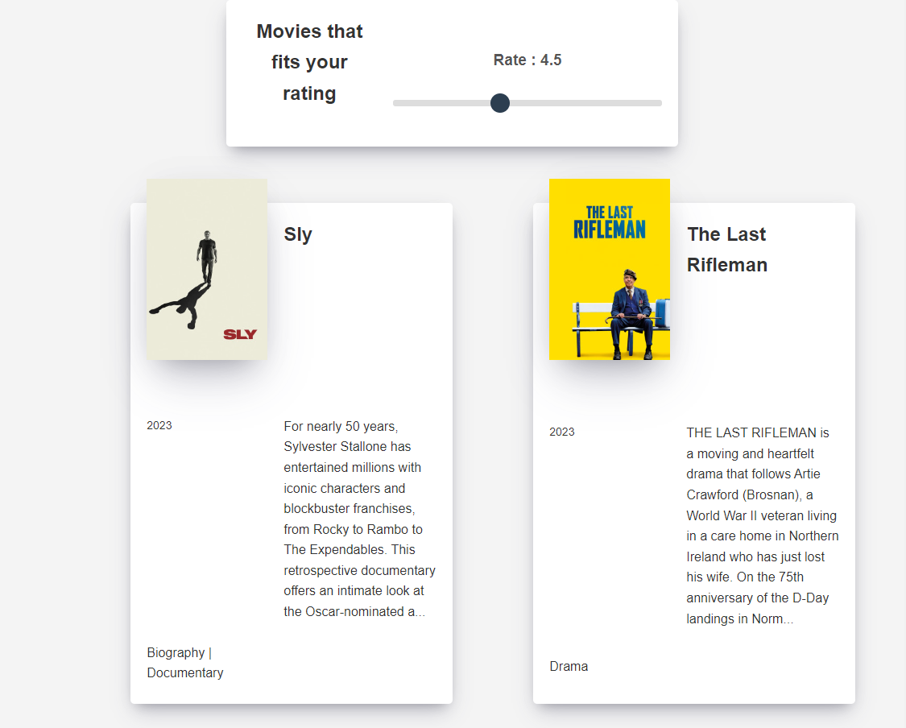
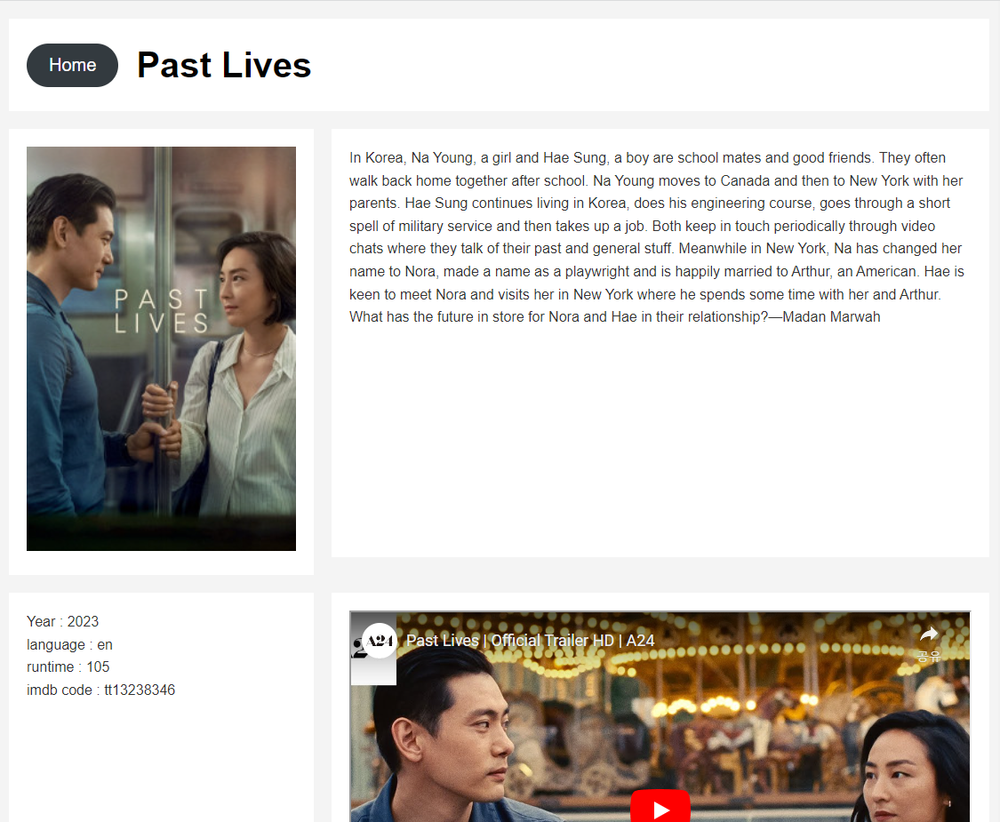

# Movie App

**[Start](https://hwahyeon.github.io/reactjs-movieapp/)**

## Overview
**Movie App** is a web application that allows users to view information about various movies. The app allows users to easily browse movie titles, descriptions, and other related information through ratings.

## Features
### Home
- This is a picture of **Home**, and if you select the rating you want at the top, the app will show you movies that fits your rating.  

### Detailed
- Detailed Information on Click: Clicking on a movie poster or title leads to a page with more in-depth details about the movie. This includes: Description, Year of Release, Language, Running Time and Trailer Video

